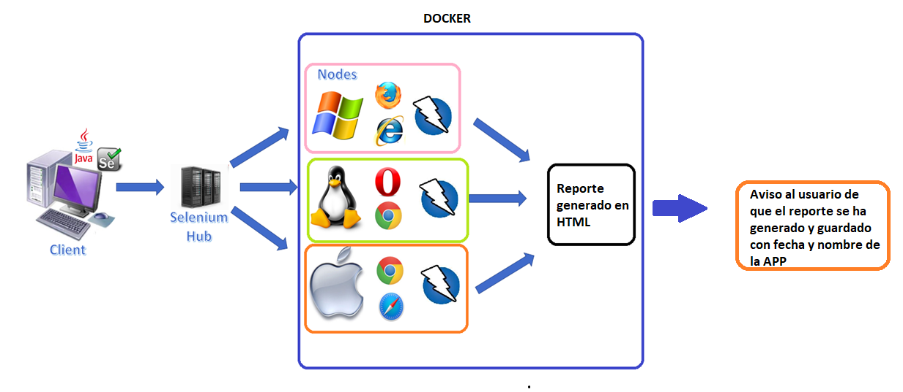

## Automatizacion de la app ZAP mediante SELENIUM y DOCKER (WIP!)

####Resumen

Basicamente este proyecto tratara de como poder automatizar los escaneos de seguridad de la applicaciones realizados con la Herramienta OWasp oZAP.

De esta manera podremos poder ejecutar ciertos test de manera independiente sin necesidad del bloqueo del PC, ya que este tipo de ejecución se realizara en local.

##1.Ciclo de vida.

Como la imagen refleja, el ciclo de vida de nuestra aplicación local, representa el como funcionara todos los elementos de nuestra app.

###(WIP)
El cliente ejecutara un pequeño programa donde se lanzara varias instancias de DOCKER, en las que pondremos varios SO, programas y navegadores.
Cuando estas instancias estén levantadas con éxito, se desplegara un pequeño programa donde se seleccionara de un listado la URL de la aplicación correspondiente que queremos escanear.   

Si todo va bien, se debería ejecutar una instancia por test, para de esta manera podamos ejecutar o poder realizar 3 escaneos, basicamente una instancia, test, por contenedor.

Una vez se han lanzado el test, o los test, se debería crear, en caso de que no exista, una carpeta y subcarpeta para poder guardar los resultados de las ejecuciones generar y exportar el reporte realizado con el siguiente formato de:
*   Fecha + ID-NombreAPP.
*   Ejemplo = 24/01/2022_345-GECO.html.

Una vez realizado este proceso estaría bien que se creara un mini sistema de notificación para estar al tanto del estado de los reportes, en caso de que estos estén en proceso o que ya se hubiesen generado con éxito.

(Adjuntare mas imagenes de como funcionaria cada cosa.)

